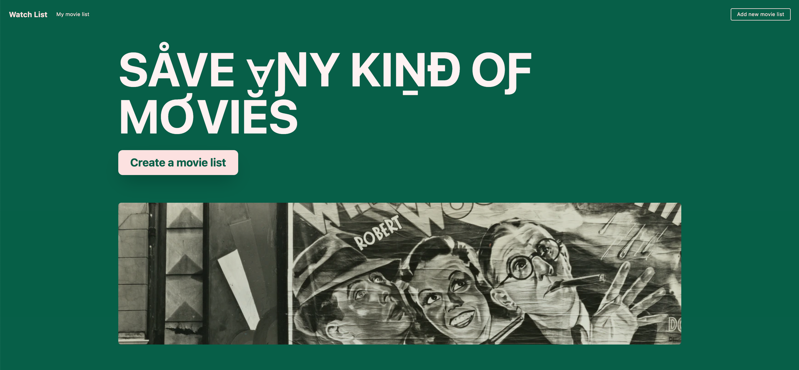
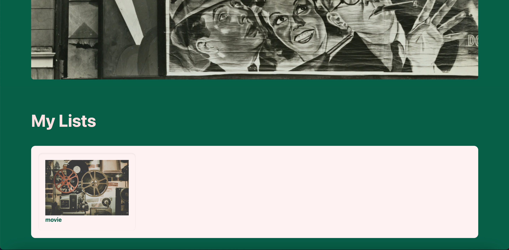
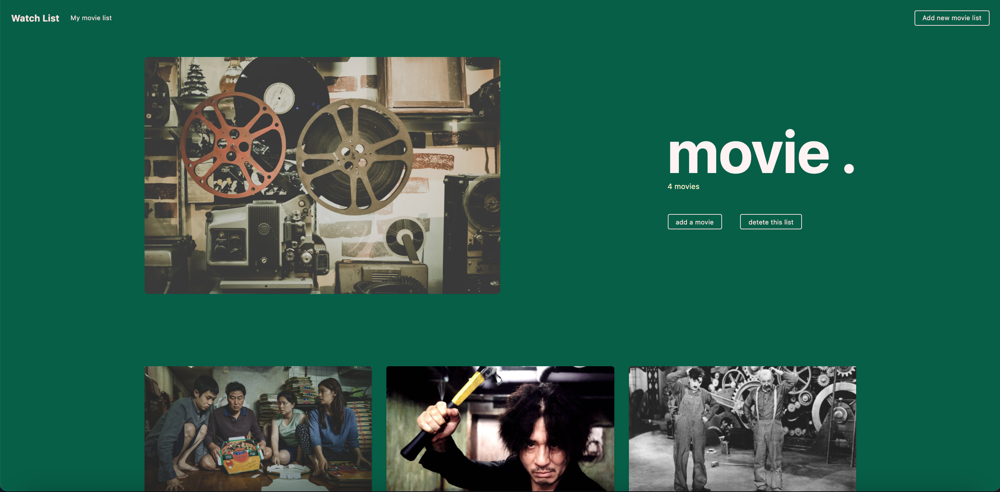
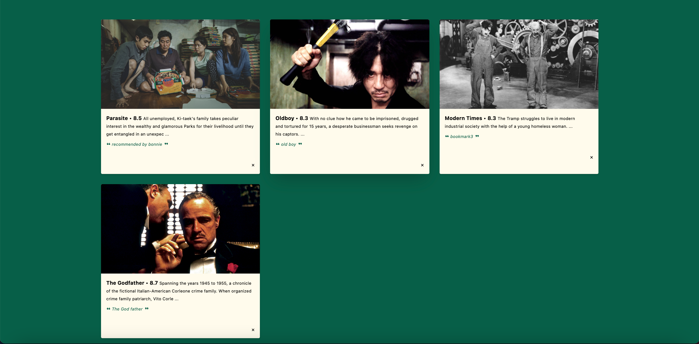
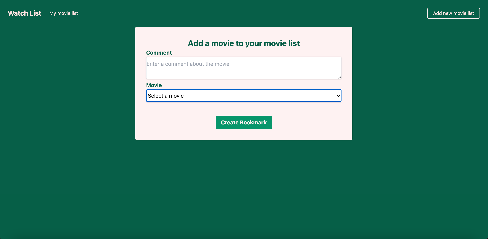

# Movie watch list

A CRUD web application for archiving movie selections

[Go to website](https://movie-watch-list-app.herokuapp.com)

## Skills I used
Ruby on Rails, JavaScript, HTML, TailwindCSS, PostgreSQL, Heroku

## Pages

Homepage

User's movie list

Movie show page

Bookmark list

Create a new movie list

Add a new movie bookmark to the movie list

