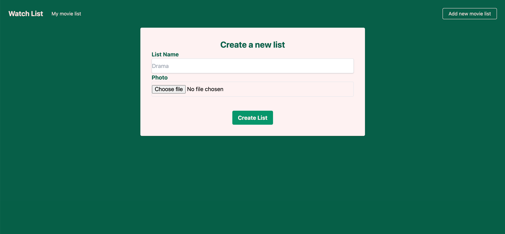

# Movie watch list

A CRUD web application for archiving movie selections

[Go to website](https://movie-watch-list-app.herokuapp.com)

I built this app to consolidate ruby on rails again and remind myself to build a MVC structure on my own from the scratch to the deployment. Also, I wanted to practice new CSS framework, TailwindCSS on this app, which I have never used before. All movies are generated by this [themoviedb API](https://www.themoviedb.org/documentation/api) call.

## Skills I used
Ruby on Rails, HTML, TailwindCSS, PostgreSQL, Heroku

## Pages

Homepage 

User's movie list : user can create any kind of movie list.

Movie show page : within each movie list, user can add, delete and see all their favorite movies selected by themselves.

Bookmark list : user can leave some comment on the bookmark.

Create a new movie list : create new movie list with movie photo and title.

Add a new movie bookmark to the movie list : select a movie user want to add and create new movie bookmark with comment.

